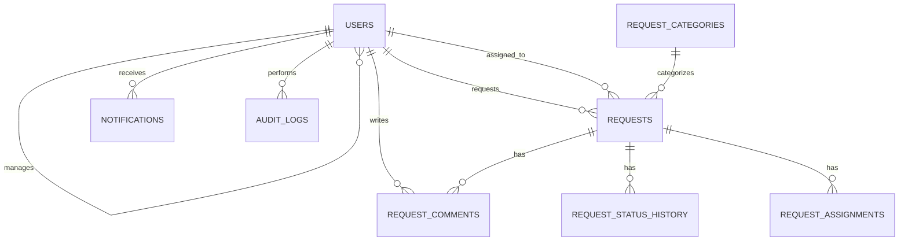

# Business Workflow Automation Platform

[](https://github.com/nandinisangu7-hub/business-workflow-automation-platform/actions/workflows/ci.yml)
[](https://www.python.org/)
[](https://fastapi.tiangolo.com/)
[](https://react.dev/)
[](https://www.docker.com/)

A full-stack, enterprise-style workflow management platform demonstrating
production-oriented software engineering practices: JWT authentication,
role-based authorization, a validated workflow state machine, audit
logging, notifications, search/filter/pagination, external API
integration, and a layered backend architecture -- backed by 49 automated
tests and a green CI pipeline.

## Project Status: Completed

Backend, frontend, database layer, authentication, workflow engine, audit
logging, notifications, external API integration, automated testing, CI,
and containerized deployment via Docker Compose are all implemented and
verified working end-to-end.

## Key Features

**Authentication & Authorization**
- JWT-based authentication with bcrypt password hashing
- Role-Based Access Control -- Employee, Manager, Admin
- Backend-enforced permissions (never trusted from the frontend alone)

**Workflow Engine**
- Business request lifecycle with validated state transitions
- Request assignment and reassignment
- Full audit trail of every status change

**Platform Capabilities**
- Server-side search, filtering, and pagination
- Role-aware dashboard summaries
- In-app notifications
- Append-only audit logging for compliance/traceability
- External API integration (holiday-check service)
- Centralized input validation and error handling

**Engineering Practices**
- RESTful API, versioned (`/api/v1`), documented via OpenAPI/Swagger
- Layered architecture: routes -> services -> repositories -> database
- 49 automated tests (unit + integration), backend tests run against a
  real PostgreSQL container in CI
- Frontend tests via Vitest + React Testing Library
- Dockerized (multi-stage builds, non-root containers) and orchestrated
  via Docker Compose
- CI/CD via GitHub Actions

## Workflow

Every transition is validated against an explicit state machine and
recorded in an append-only history table, powering a full audit timeline
for each request.

## Architecture
                React + TypeScript
                       |
                       | HTTPS / JSON
                       v
                FastAPI REST API
                       |
         ------------- | --------------
         v             v              v
   Authentication   Services      Integrations
   & Authorization      |          (External API)
                         v
                   Repositories
                        |
                        v
                   PostgreSQL
                   /        \
                  v          v
             Audit Logs   Notifications

## Technology Stack

| Layer | Technologies |
|---|---|
| Frontend | React, TypeScript, Vite, React Router |
| Backend | FastAPI, Pydantic, SQLAlchemy, Alembic |
| Database | PostgreSQL |
| Auth | JWT (python-jose), bcrypt (passlib) |
| Testing | Pytest, HTTPX, Vitest, React Testing Library |
| DevOps | Docker, Docker Compose, GitHub Actions |

## Database Design



8 normalized tables, UUID primary keys. Full detail: [`docs/DATABASE.md`](docs/DATABASE.md).

## API Reference

Base path: `/api/v1`. Interactive docs at `/docs` (Swagger) and `/redoc`
once running. Full reference: [`docs/API.md`](docs/API.md).

| Method | Path | Access |
|---|---|---|
| POST | `/auth/register`, `/auth/login` | Public |
| GET | `/auth/me` | Authenticated |
| GET / PATCH | `/users`, `/users/{id}` | Manager/Admin, Admin |
| GET / POST | `/requests` | Authenticated (search/filter/pagination) |
| GET / PATCH | `/requests/{id}` | Authenticated, ownership-checked |
| POST | `/requests/{id}/assign`, `/transition` | Role + ownership enforced |
| GET / POST | `/requests/{id}/comments` | Authenticated |
| GET | `/notifications` | Authenticated |
| GET | `/audit-logs` | Admin only |
| GET | `/dashboard/summary` | Authenticated (role-aware) |

## Testing

```bash
cd backend && PYTHONPATH=. pytest -v      # 49 tests
cd frontend && npm run test
```

CI runs both suites on every push, with backend tests executed against a
real PostgreSQL service container -- not just SQLite -- to catch
dialect-specific issues before they reach production. Full detail:
[`docs/TESTING.md`](docs/TESTING.md).

## Running Locally

**With Docker (recommended):**
```bash
cp .env.example .env
docker compose up --build
```
Backend: `http://localhost:8000/docs` -- Frontend: `http://localhost:80`

**Without Docker:**
```bash
# Backend
cd backend
python3 -m venv .venv && source .venv/bin/activate
pip install -r requirements.txt
cp ../.env.example .env
PYTHONPATH=. alembic upgrade head
PYTHONPATH=. uvicorn app.main:app --reload
```
```bash
# Frontend (separate terminal)
cd frontend
npm install
npm run dev
```

**Demo credentials:**
```bash
cd backend
SEED_PASSWORD="choose-a-local-password-min-8-chars" PYTHONPATH=. python3 scripts/seed_users.py
```
Creates `admin@example.local`, `manager@example.local`, `employee@example.local`.

## Project Structure

## Documentation

[`docs/ARCHITECTURE.md`](docs/ARCHITECTURE.md) --
[`docs/DATABASE.md`](docs/DATABASE.md) --
[`docs/AUTHENTICATION.md`](docs/AUTHENTICATION.md) --
[`docs/WORKFLOW.md`](docs/WORKFLOW.md) --
[`docs/API.md`](docs/API.md) --
[`docs/TESTING.md`](docs/TESTING.md)

## Future Improvements

- JWT server-side revocation via a token blocklist
- Deploy to a cloud environment (currently runs locally via Docker Compose)
